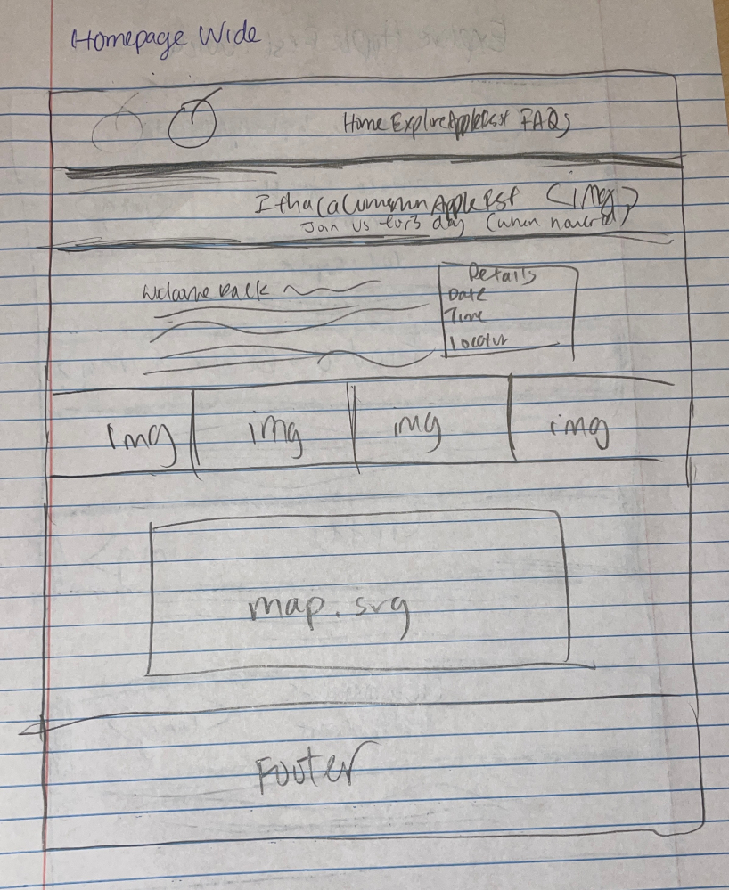
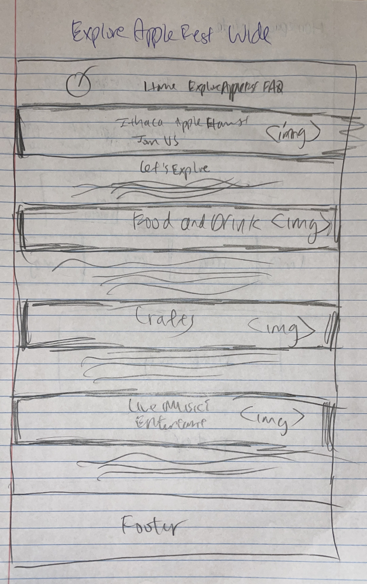
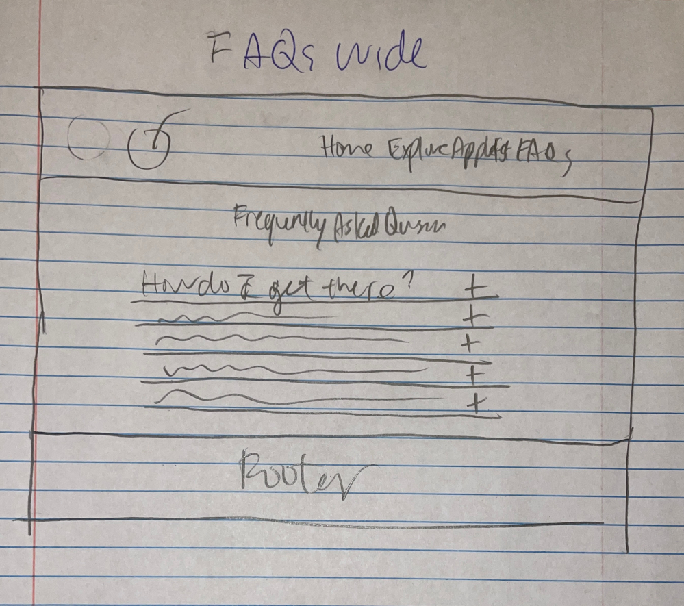

# Project 1, Milestone 1: Design Journey

[← Table of Contents](design-journey.md)

**Replace ALL _TODOs_ with your work.** (There should be no TODOs in the final submission.)

Be clear and concise in your writing. Bullets points are encouraged.

Place all design journey images inside the "design-plan" folder and then link them in Markdown so that they are visible in Markdown Preview.

**Everything, including images, must be visible in _Markdown: Open Preview_.** If it's not visible in the Markdown preview, then we can't grade it. We also can't give you partial credit either. **Please make sure your design journey should is easy to read for the grader;** in Markdown preview the question _and_ answer should have a blank line between them.

## Existing Design

**Make the case for your decisions using concepts from class, as well as other design principles, theories, examples, and cases from outside of class (includes the design prerequisite for this course).**

You can use bullet points and lists, or full paragraphs, or a combo, whichever is appropriate. The writing should be solid draft quality.

### Existing Site: The Site
> What is your existing site about? Tell us about it. (1 sentence)

My existing site is about the Ithaca Apple Fest with various information like the time, date, details, activities, and other FAQs.

> How and where did you create this site? (1 sentence)

I created an initial draft of the website around October toward the end of November last semester in INFO 1300, and during the winter break, I fixed the design of the website by adding an accordion instead of a column for the FAQs and changed the design to be more minalistic and easy to read.

> Is this site designed for desktop, mobile devices or both? (1 sentence)

This site is for both desktop and mobile devices because my site is responsive to both devices and 850px is the changing point.

> Explain why this website is a **static** website. (1 sentence)

The website is a static website because for every user, the content remains the same, and the website is hosted through html files rather than PHP.

### Existing Site: Audience
> Briefly explain your site's audience.
> Be specific and justify why this audience is a **cohesive** group. (1-2 sentences)

My site's audience is people who are in or near Ithaca (either people who live in or near Ithaca locally, or students attending schools in Ithaca), and this is a cohesive group because something they all have in common are their desires to do something fun and enjoy their lives in Ithaca, where there are rarely any fun events to do.

### Existing Site: Audience Goals
> Document your existing site's audience's goals. (These should be informed by user research. Not assumptions or stereotypes.)
> List each goal below. There is no specific number of goals required for this, but you need enough to do the job (Hint: It's more than 1 and probably more than 2).

Goal 1: Easily access the detailed information of Apple Fest through easy to navigate website navigation with no distractions or unorganized content.

Goal 2: Easily be able to find information about Apple Fest on the day of at the event on their mobile devices such as the map.

Goal 3: Easily navigate the sections of the website that can help them plan their event hangout date.

### Existing Site: Design/Sketches
> Sketch each page of your existing site.
> **You may not copy your sketches from a previous assignment.**
> Why can't you copy the sketches? I want to get you thinking about the strengths/weaknesses of your current design.
> Provide a **1 sentence** description _underneath_ each sketch that describes the page.

>Homepage Wide
>
>In this homepage wide version, this presents an overview of the Apple Fest to mainly introduce and and get a glimpse of what the event is like, with catchy full screen images, a brief description, event details, and a map.
>
>Explore Apple Fest Wide
>
>
>
>In this explore apple fest wide version, this presents detailed section of all the activities of the Apple Fest to mainly showcase the fun things to do so that the users can join, with full screen images with section heading text overlay.
>
>FAQs Wide
>
>In this FAQs wide version, this presents possible and commonly asked questions such as the directions, price and more in case the users have more questions that can't be answered on the other pages, with an accordion.

[← Table of Contents](design-journey.md)
