# Project 1, Milestone 2: Design Journey

[← Table of Contents](design-journey.md)

**Replace ALL _TODOs_ with your work.** (There should be no TODOs in the final submission.)

Be clear and concise in your writing. Bullets points are encouraged.

Place all design journey images inside the "design-plan" folder and then link them in Markdown so that they are visible in Markdown Preview.

**Everything, including images, must be visible in _Markdown: Open Preview_.** If it's not visible in the Markdown preview, then we can't grade it. We also can't give you partial credit either. **Please make sure your design journey should is easy to read for the grader;** in Markdown preview the question _and_ answer should have a blank line between them.

## Milestone 1 Feedback Revisions
> Explain what you revised in response to the Milestone 1 feedback (1-3 sentences)

I did not get any feedback from my Milestone One, but I did decide to add another audience goal that will make the form in my website's design help to address the goals of the site’s audience: Goal 4: Easily be able to get any last minute updates abut cancelation of events, or just updates about changes in general.

## Refined Design

### Refined Design: Persona
> Use the goals you identified and your prior user research to develop a persona of your site's audience.
> Your persona must have a name and a face. The face can be a photo of a face or a drawing, etc.
> You may type out the persona below with bullet points or include an image of the persona. Just make sure it's easy to read the persona when previewing markdown.

Persona's Name: Bella

Bella is a student at Cornell University that wants to plan a fun hangout event with her friends. For more details, please read the image. Thanks!

>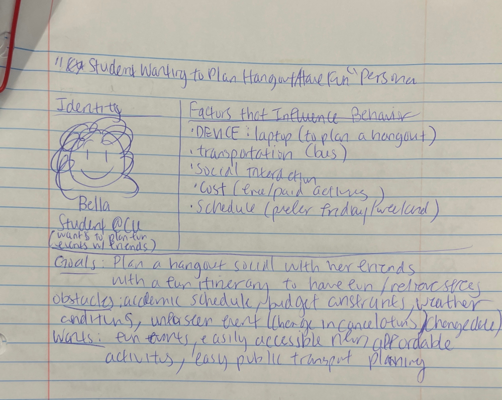

### Refined Design: Narrow or Wide
> Will your refined design be functional on narrow or wide device? (a few words)

Bella will access the Apple Fest website through desktop, or a wide device because she will want to take time and closely evaluate and plan out their hangout details carefully.

### Refined Design: Form Brainstorm
> Brainstorm ideas for collecting data from your persona on your website.
> The form must support the persona's goals when using the website.
> For each form idea, explain how the form supports the goals of the persona. (1 sentence per idea)
> **Refer to the persona by name.**

- Option 1: This form will be a general "Contact Us" form for Bella if she has any questions and will include her email address and a text area for her questions and this will help Bella clarify any questions needed for the planning.
- Option 2: This form will be option to subscribe/register for the event so that the event can contact them if there are any changes to the itinerary/schedule, and this will help Bella and her group know about the changes that will affect their hangout plan.
- Option 3: This form will be an subscription to exclusive deals and discounts about special offers or promotions about this event, and it will help Bella plan and make budet conscious decisions during the planning process.

### Refined Design: Content
> List **all** the content you plan to include your website for your **persona**.
> You should list all types of content you planned to include (i.e. text, photos, images, etc.)
> List the content here. Label the content as "(new)" if it's new to the existing site.
> **Do not include the content here, just provide a list summarizing the content.**

- Festival Time, Date, and Location: Easy to read text with when and where the Apple Fest takes place.
- What is Apple Fest: a short description on what Apple Fest is formally.
- Food Vendors: Introduction of vendors for fresh produce, food vendors, and more.
- Crafts: Introduction of Crafts vendors
- Entertainment Music Lineup: An introduction and schedule of when the music bands/singers are performing
- FAQs: A list of frequently asked questions and answers to the common questions such as whether to bring cash or not, directions and parking
- Apple fest Logo: I plan to put the logo next to the navigation bar.
- Apple fest map: An image of the map of where the vendors and events are located so that it is easy to navigate.
- Images: images related to Apple Fest
- Contact Us: Contact information
- Form: a form that collects Bella's email address, checkboxes for what kind of activities she wants to hear updates about if it is canceled or not

### Refined Design: Content Justification
> Explain why this content supports the goals of your persona. (1-2 sentences)
> **Refer to the persona by name.**

My website supports Bella's goals because I provided a lot of festival details, activites, and content such as the form and images and this will make the planning and scheduling so much easier and more fun for Bella.

### Refined Design: Content Organization
> Organize the content for the audience and identify possible pages for the content using **several iterations** of card sorting.
> Include photographic evidence of each iteration of card sorting **and** an explanation of your thought process for each iteration. (1 sentence per iteration)
> **Please physically sort cards;** please don't try and do this digitally.
> **Refer to the persona by name.**

Iteration 1: I separated the content based on these categories: "FAQs" where it would be FAQs and a Contact Us, Homepage where it will contain basic details about the festival, and then planning the trip of more specific activities to do and a form registration for the event.
>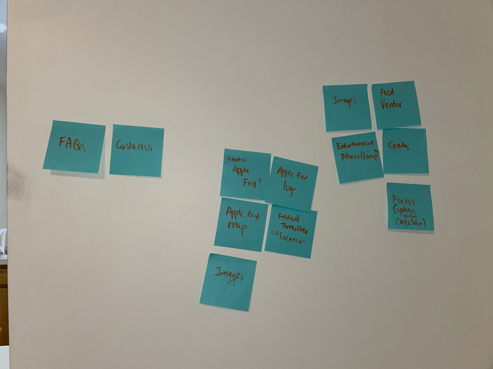

Iteration 2: I separated the content based on these categories: "FAQs" where it would be FAQs, a Contact Us and what is different is the form registration because I felt like users like Bella would be more certain to fill the form after looking through FAQs carefully, Homepage where it will contain basic details about the festival but I removed the map, and then planning the trip of more the specific activities to do with the map because users like Bella would probably want to know the directions to plan the schedule.

>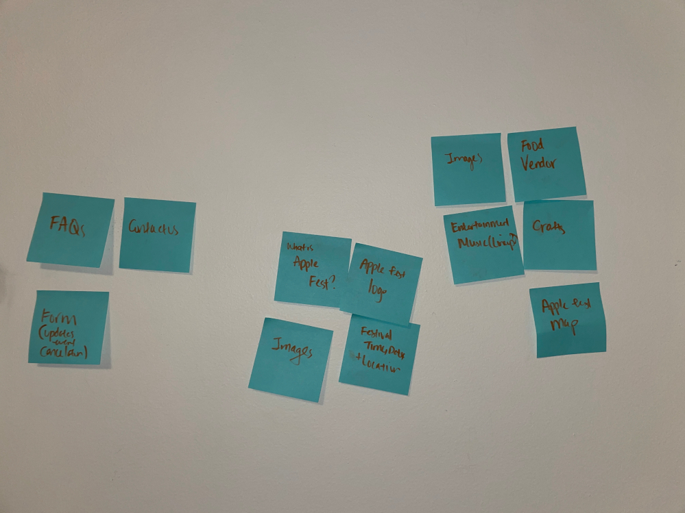

Iteration 3: I separated the content based on these categories: "FAQs" where it would be FAQs, registration form, and the map this time because the directions is something that the users would wonder about, Homepage where it will contain basic details about the festival, and then planning the trip of more the specific activities since some users may only want to know about this.

>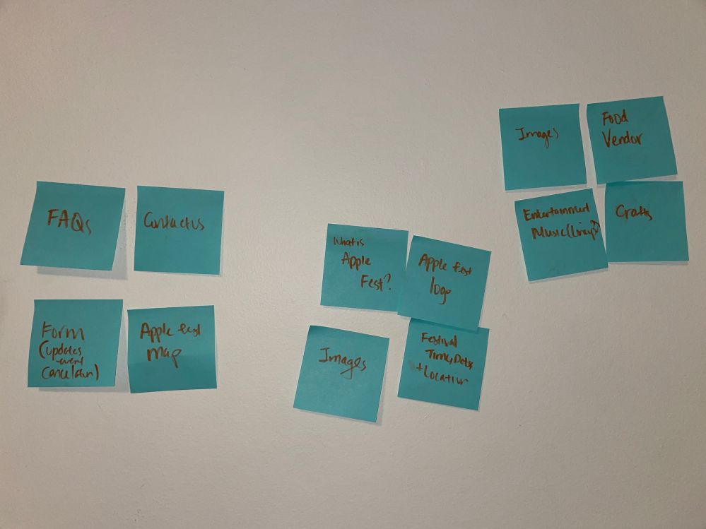

### Refined Design: Navigation
> Please list the pages you will include in your website's navigation.

- Home
- Planning Your Visit
- FAQs

> Explain why the names of these pages make sense for your persona. (1 sentence)

The names make sense for Bella because the homepage is a central starting point where Bella can find an overview of the festival, allowing her to quickly access essential information and navigate to specific sections for detailed planning, the "Planning Your Visit" page caters directly to Bella's goal of planning hangouts and having a well-organized experience, providing her with comprehensive details, schedules, and resources to ensure a successful visit to the Apple Fest, and "FAQs" page addresses common questions and concerns, offering Bella a quick and straightforward resource to alleviate any uncertainties and facilitate smooth planning for her and her group.

### Refined Design: Design
> Refine the design of your site to address the goals of your persona.
> Include iterations of **sketches** for each page of the refined design.
> Provide a brief explanation _underneath_ each sketch. (1 sentence per sketch)
> **Refer to your persona by name in each explanation.**

Homepage

Iteration Draft One: In this iteration, I decided to put all the important content on the left side and put the image of the map on the right side so that Bella won't skim past the date/time/location section, because orginally, it was in a gray side bar and it was easy to skim past it.
>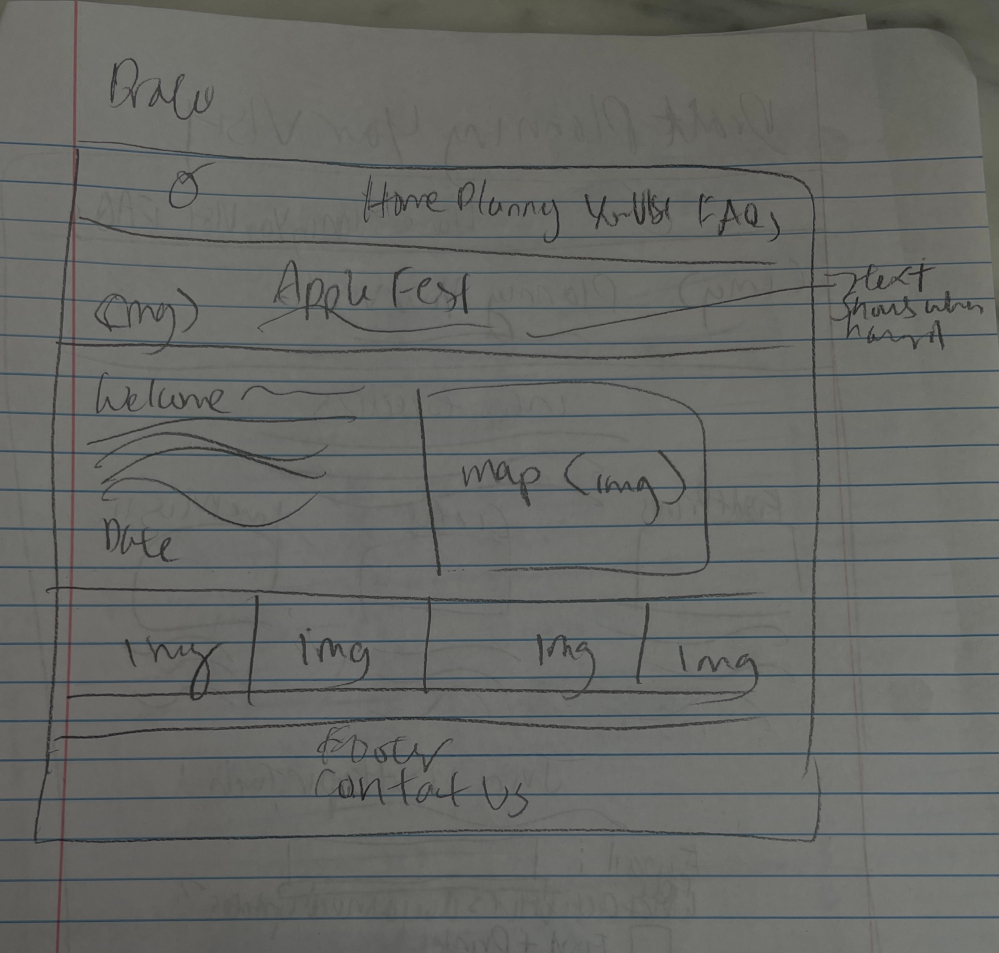

Final One: For the final, I chose to center align the entire text content and place the map on its own section at the bottom because through this design, Bella can easily understand if Apple Fest is the event that she wants to plan with essential basic information from the start laid out in an easy to understand way.
>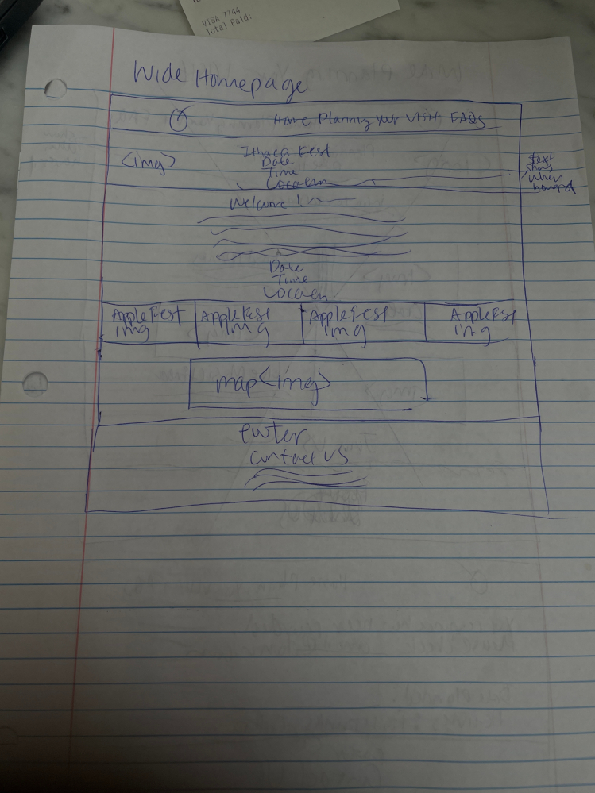

Planning Your Visit

Iteration Draft One: In this iteration, what was different from the orginal was that I wanted to layout the activities with minimal scrolling so I used the three grid layout with images since I didn't want Bella to forget the activities and having to scroll past through a blog style website, which would make her confused about how to plan the visit, and not fill out the registration form.
>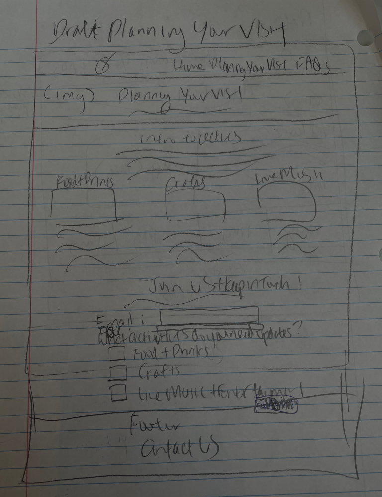

Final One: For the final, I chose to use a two grid layout with image and text content for each activity so that it is minimal scrolling, but Bella can also clearly see the image of the event without being overwhelmed with three activities in one go, which would help her understand how to plan the visit.
>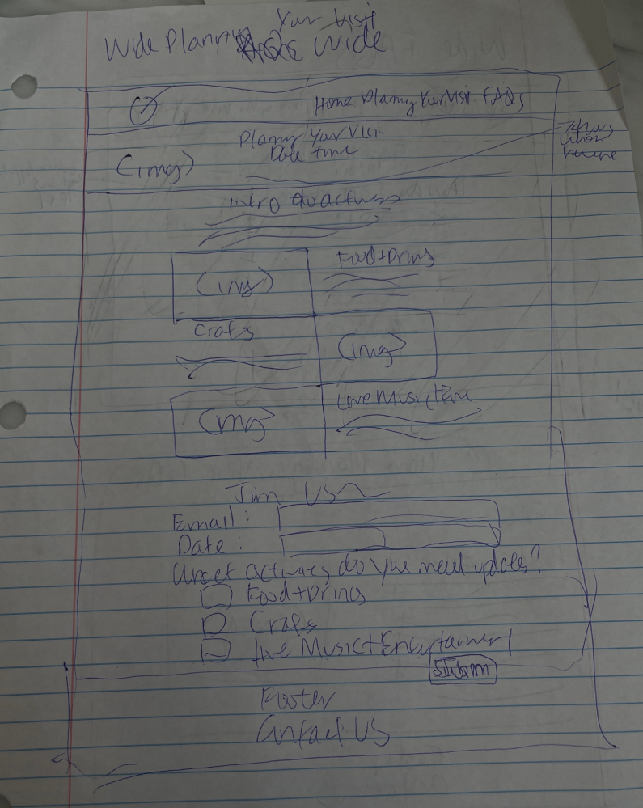

Confirmation

Iteration Draft One: In this iteration, I wanted to focus on the fact that that the server has received Bella's registration form, so it was focused more on like a survey style form where there is a statement response is recorded and receipt of her responses, which would help Bella know that Apple Fest will send updates if there are any changes.
>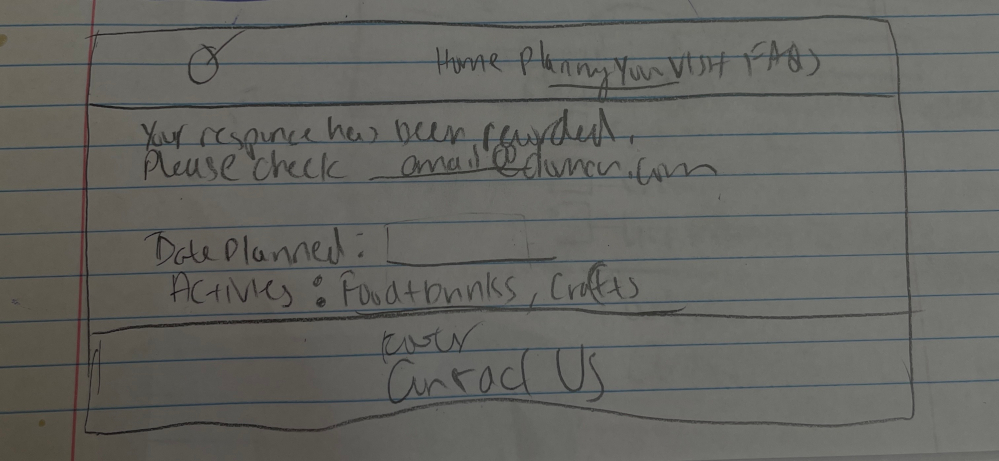

Final One: For the final, I had a similar format to my second one, but I added headings to reiterate that this was a confirmation page and a message reminder to check their email to see if their response was actually recorded, and this would reassure Bella in case of last minute Apple Fest changes so they can adjust plans if applicable.
>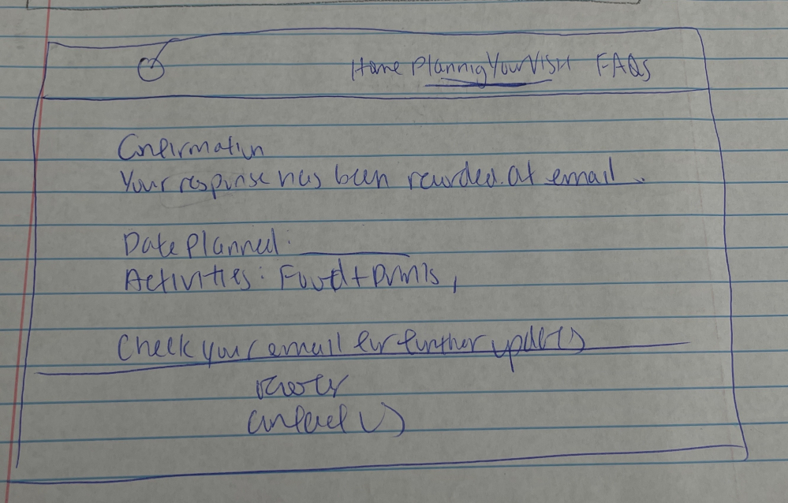

FAQs

Iteration Draft One: In this iteration, I added an image next to the accordion so that Bella could still get a taste and learn more about Apple Fest compared to a bland FAQs page.
>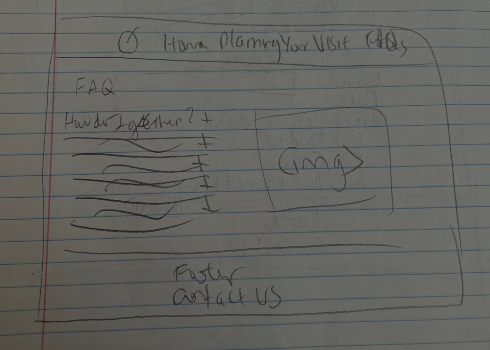

Final One: For the final, I decided to get rid of the image and keep it simple so that it would be easier for Bella to navigate through the website since adding an image next to the accordion in an unfamiliar website practice and I don't want to confuse her.
>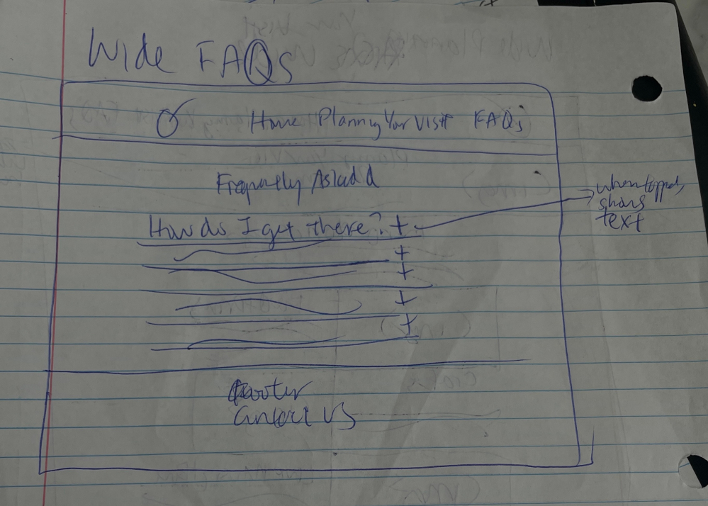

### Partial Plan
> Using your refined sketches, plan your site's partials.
> You may describe each partial or sketch it. It's up to you!
> Explain how you will customize at least 1 partial. (1 sentence)

I will make a header partial that contains all of the nav bar content, and I will customize it by creating an active class and variables like $home_class, $planningyourvisit_class, and $faqs_class which will make the nav bar link of the current page red and underlined. For the footer, I will include the "Contact information" and not make this customizable as it is the same across all pages.

[← Table of Contents](design-journey.md)
