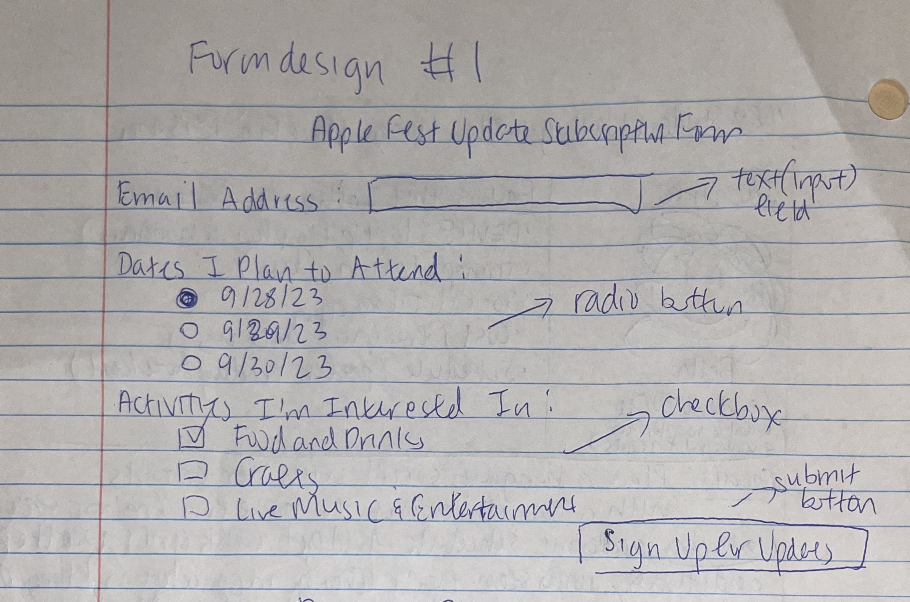
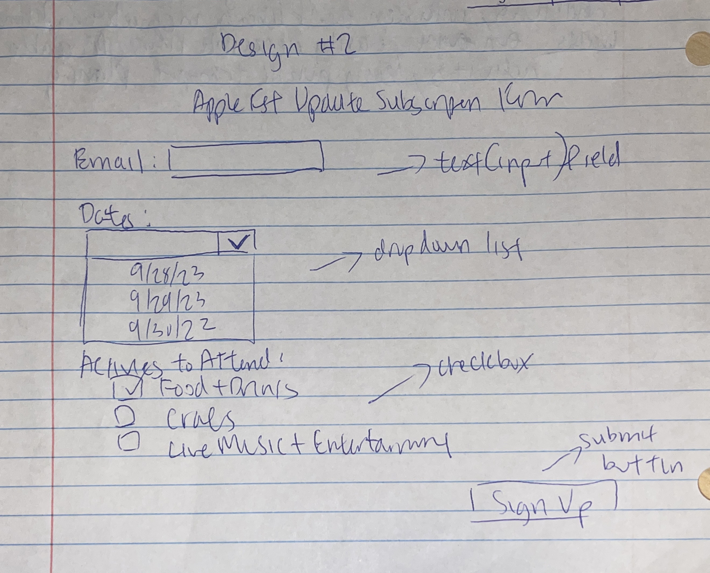
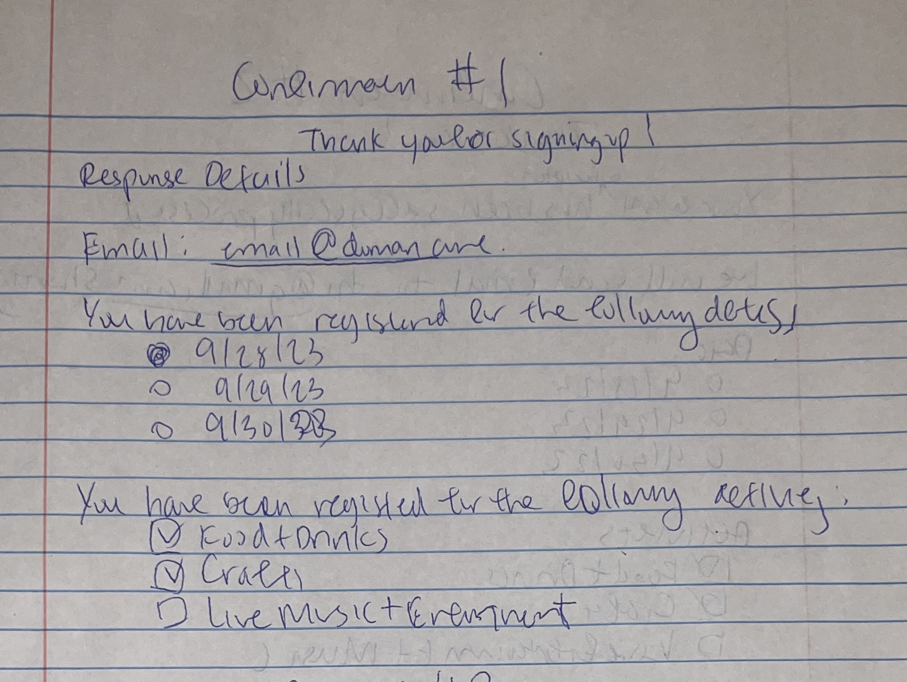
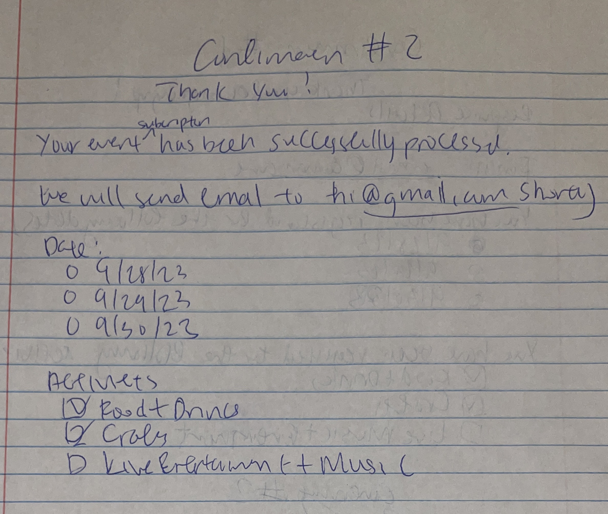

# Project 1, Milestone 3: Design Journey

[← Table of Contents](design-journey.md)

**Replace ALL _TODOs_ with your work.** (There should be no TODOs in the final submission.)

Be clear and concise in your writing. Bullets points are encouraged.

Place all design journey images inside the "design-plan" folder and then link them in Markdown so that they are visible in Markdown Preview.

**Everything, including images, must be visible in _Markdown: Open Preview_.** If it's not visible in the Markdown preview, then we can't grade it. We also can't give you partial credit either. **Please make sure your design journey should is easy to read for the grader;** in Markdown preview the question _and_ answer should have a blank line between them.

## Milestone 2 Feedback Revisions
> Explain what you revised in response to the Milestone 2 feedback (1-3 sentences)
> If you didn't make any revisions, explain why.

I refined the form and confirmation design sketches again since I wanted to fix some design aspects.

## Form Design and Planning

### Form Purpose & Persona Goals
> Explain your form's purpose and how it supports the goals of your persona. (1-2 sentences)

This form enables users to subscribe for event updates, ensuring they receive timely notifications about any changes or cancellations about the activites they signed up for. By registering for events, Bella and her group can stay informed about schedule adjustments in case they need to make any last minute schedule plan changes.

### Form Design
> Design your site's form.
> Include iterations of **sketches** of the form.
> Provide a brief explanation _underneath_ each sketch. (1 sentences for each sketch)

This form includes a text field for email, radio buttons for the dates since there are only three dates, and checkboxes for the activities because I wanted to emphasize the convenience and user friendliness for Bella to fill out this form.
>

This form includes a text field for email, dropdown list for the dates since it could be too long and might be distracting for Bella, and checkboxes for the activities because I wanted Bella to fill this form out without any confusion to she and her group can get updates.
>

### Form Confirmation
> Design your site's form confirmation page.
> Include iterations of **sketches** of the form.
> Provide a brief explanation _underneath_ each sketch. (1 sentences for each sketch)

This confirmation page looks exactly like the form except that the empty text fields like email wil be filled in, and the radio and checkboxes will be checked off, which means that Bella can just quickly skim through what she had just filled out and double check that this is good to go.
>
This confirmation page looks exactly like the form except for the email part, it will be a message where Apple Fest will be sending to their email, and this will help Bella see clearly that this is a confirmation page, while the important content like dates and activities remain the same as the original form.
>

### Form Planning
> Will your form use a GET or POST request?
> Justify your decision as to why the request type is appropriate for the form. (1 sentence)

My form will use a POST request because my form is requesting private data, such as the user's email.

[← Table of Contents](design-journey.md)
