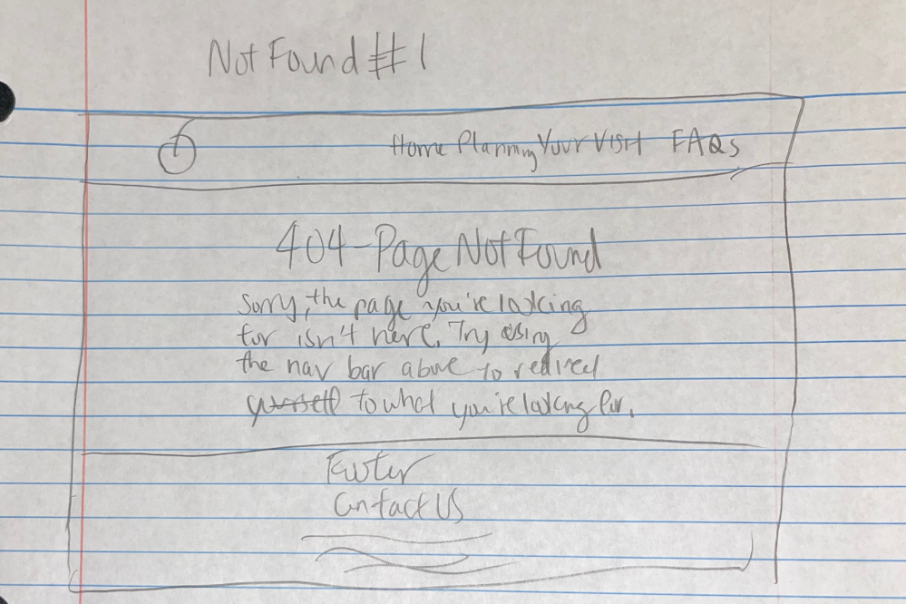
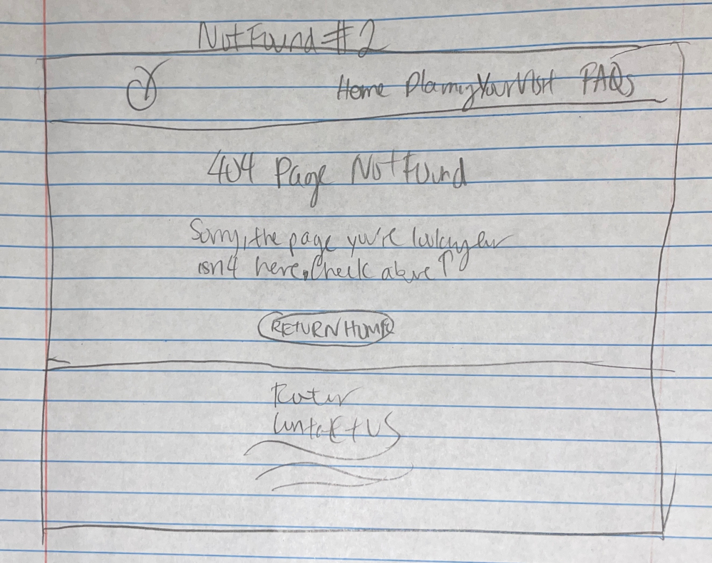

# Project 1, Final Submission: Design Journey

[← Table of Contents](design-journey.md)

**Replace ALL _TODOs_ with your work.** (There should be no TODOs in the final submission.)

Be clear and concise in your writing. Bullets points are encouraged.

Place all design journey images inside the "design-plan" folder and then link them in Markdown so that they are visible in Markdown Preview.

**Everything, including images, must be visible in _Markdown: Open Preview_.** If it's not visible in the Markdown preview, then we can't grade it. We also can't give you partial credit either. **Please make sure your design journey should is easy to read for the grader;** in Markdown preview the question _and_ answer should have a blank line between them.

## Milestone 3 Feedback Revisions
> Explain what you revised in response to the Milestone 3 feedback (1-3 sentences)
> If you didn't make any revisions, explain why.

In response to the Milestone 3 feedback, I felt like my project adheres to all the requirements, where the submit button should be located all the way aligned to the bottom right. However, I realized that I decided to make the text input field below Email: because I wanted Bella and other users to follow a reading scanning pattern that where their eyes would follow downward because before, there was a little bounce in following the form. New design sketch can be found in Milestone 3 Design Journey. I also decided to change the confirmation design to Iteration Two that I already sketch out in Milestone 3 because of my new form design, and because I wanted Bella to quickly know that this is a confirmation message and having another email input bullet point seems unnecessary.

## URL Design
> Plan your HTTP routing.
> List each route and the PHP file for each route.

| Route                                  | PHP File                            |
| ---------------------------------------| ----------------------------------- |
| /                                      | pages/index.php                     |
| /planning-your-visit                   | pages/planningyourvisit.php         |
| /planning-your-visit/confirmation      | pages/confirmation.php              |
| /faqs                                  | pages/faqs                          |

> Explain why these routes (URLs) are usable for your persona. (1 sentence)

These routes are usable for Bella because they describe the page that Bella will be navigating too, like the homepage being / because this is the typical design for homepage, and since my form is located on planning-your-visit page, the confirmation page should also be directly related using another /.

## Missing Resource / Not Found Page
> Refine the design of your site's missing resource 404 page for your persona.
> Include iterations of **sketches** of the page.
> Provide a brief explanation _underneath_ each sketch. (1 sentence)
> **Refer to the persona by name.**

>
This not found page includes the nav bar, 404 Page Not Found title, message explaining what the message mean, and the footer because I want Bella to still know that she is on the same webpage, and I want her to quickly understand and renavigate back to where she is looking for.

>
This not found page includes the nav bar, 404 Page Not Found title, message explaining what the message mean, a return home button and the footer because I want Bella to still know that she is on the same webpage and be able to renavigate back to where she is looking for, and for her convenience, the return home button will help her immediately have an option to go back to familiar page without any frustrations.

## Self-Reflection
> Take some time here to reflect on how much you've learned since you started this class. It's often easy to ignore our own progress. Take a moment and think about your accomplishments in this class. Hopefully you'll recognize that you've accomplished a lot and that you should be very proud of those accomplishments! (2-4 sentences)

From starting with the static Apple Fest website from last semester, it was enjoyable making design revisions and reflecting on the past design choices. Being able to add in server side rendered pages was so fun because adding in forms can help enhance the audience goals, specifically, my persona, Bella. Each step I took made me proud because I feel more confident in programming.

## Grading

### Grading: Mobile or Desktop
> When we grade your final site, should we grade this with a narrow or wide screen?

Wide Screen

### Collaborators
> List any persons you collaborated with on this project.

N/A

### Reference Resources
> Please cite any external resources you referenced in the creation of your project.
> (i.e. W3Schools, StackOverflow, Mozilla, etc.)

N/A

[← Table of Contents](design-journey.md)
